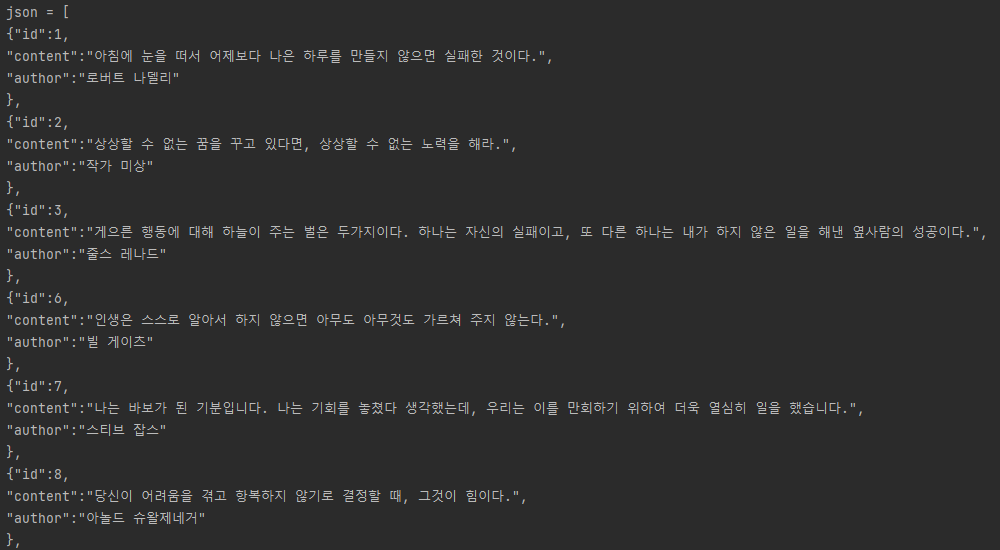

<div id="top"></div>
<!--
*** Thanks for checking out the Best-README-Template. If you have a suggestion
*** that would make this better, please fork the repo and create a pull request
*** or simply open an issue with the tag "enhancement".
*** Don't forget to give the project a star!
*** Thanks again! Now go create something AMAZING! :D
-->

<!-- PROJECT SHIELDS -->
<!--
*** I'm using markdown "reference style" links for readability.
*** Reference links are enclosed in brackets [ ] instead of parentheses ( ).
*** See the bottom of this document for the declaration of the reference variables
*** for contributors-url, forks-url, etc. This is an optional, concise syntax you may use.
*** https://www.markdownguide.org/basic-syntax/#reference-style-links
-->


<!-- PROJECT LOGO -->
<br />
<div align="center">
  <a href="https://github.com/kimdonghyeon3/javassg">
    
  </a>

<h3 align="center">JavaSSG - Jsoon 생성기</h3>

  <p align="center">
    "오늘의 명언"사이트 제작을 위한 JSON파일 생성기
    <br />
    <a href="https://github.com/kimdonghyeon3/javassg"><strong>View Demo »</strong></a>
    <br />
    <br />

  </p>
</div>


<!-- ABOUT THE PROJECT -->
## About The Project



TDD개발 방법론을 직접 적용해 보며, JSON Paring을 구현해보고, local file을 저장하고 불러오며, 데이터베이스 없이 영속성을 유지할 수 있는 구조이다. 기본적으로 명언과 작가를 등록한 후 빌드를 진행하면, 해당 정보는 json파일로 data.json으로 저장된다. (저장 위치는 프로젝트 폴더 최상위)

<p align="right">(<a href="#top">back to top</a>)</p>

### Built With
 
<p align="right">(<a href="#top">back to top</a>)</p>

<!-- GETTING STARTED -->
## Getting Started

 본 프로젝트는 배포가 되지 않아 Local로 실행해야 합니다.

### 설치 방법

1. Clone the repo
   ```sh
   git clone https://github.com/kimdonghyeon3/javassg
   ```

2. Install NPM packages
   ```sh
   npm install
   ```
3. Run Start

<p align="right">(<a href="#top">back to top</a>)</p>

<!-- USAGE EXAMPLES -->
## Usage

1. 등록
   ```sh
   명령) 등록
   명언 : 내 사전에 불가능이란 없다.
   작가 : 나플레옹
   ```
2. 삭제
   ```sh
   명령) 삭제?id=1
   1번 명언이 삭제되었습니다.
   ```
3. 수정
   ```sh
   명령) 수정?id=1
   명언(기존) : 내 사전에 불가능이란 없다.
   명언 : 나의 죽음을 적에게 알리지 마라.
   작가(기존) : 나플레옹
   작가 : 이순신
   1번 명언이 수정되었습니다.
   ```
4. 목록
   ```sh
   명령) 목록
   번호 / 작가 / 명언
   ----------------------
   1 / 이순신 / 나의 죽음을 적에게 알리지 마라
   ```
5. 종료
   ```sh
   명령) 종료
   ```
5. 빌드
   ```sh
   명령) 빌드
   저장이 완료되었습니다.
   ```


<p align="right">(<a href="#top">back to top</a>)</p>

<!-- DEMO EXAMPLES -->
## Demo
data.json 참고


<p align="right">(<a href="#top">back to top</a>)</p>

<!-- CONTACT -->
## Contact

Email - kimdonghyeon98@gmail.com

Project Link: [https://github.com/kimdonghyeon3/javassg](https://github.com/kimdonghyeon3/javassg)

<p align="right">(<a href="#top">back to top</a>)</p>


MIT License
Copyright (c) 2021 Othneil Drew

<!-- MARKDOWN LINKS & IMAGES -->
<!-- https://www.markdownguide.org/basic-syntax/#reference-style-links -->
[contributors-shield]: https://img.shields.io/github/contributors/github_username/repo_name.svg?style=for-the-badge
[contributors-url]: https://github.com/github_username/repo_name/graphs/contributors
[forks-shield]: https://img.shields.io/github/forks/github_username/repo_name.svg?style=for-the-badge
[forks-url]: https://github.com/github_username/repo_name/network/members
[stars-shield]: https://img.shields.io/github/stars/github_username/repo_name.svg?style=for-the-badge
[stars-url]: https://github.com/github_username/repo_name/stargazers
[issues-shield]: https://img.shields.io/github/issues/github_username/repo_name.svg?style=for-the-badge
[issues-url]: https://github.com/github_username/repo_name/issues
[license-shield]: https://img.shields.io/github/license/github_username/repo_name.svg?style=for-the-badge
[license-url]: https://github.com/github_username/repo_name/blob/master/LICENSE.txt
[linkedin-shield]: https://img.shields.io/badge/-LinkedIn-black.svg?style=for-the-badge&logo=linkedin&colorB=555
[linkedin-url]: https://linkedin.com/in/linkedin_username
[product-screenshot]: images/screenshot.png
